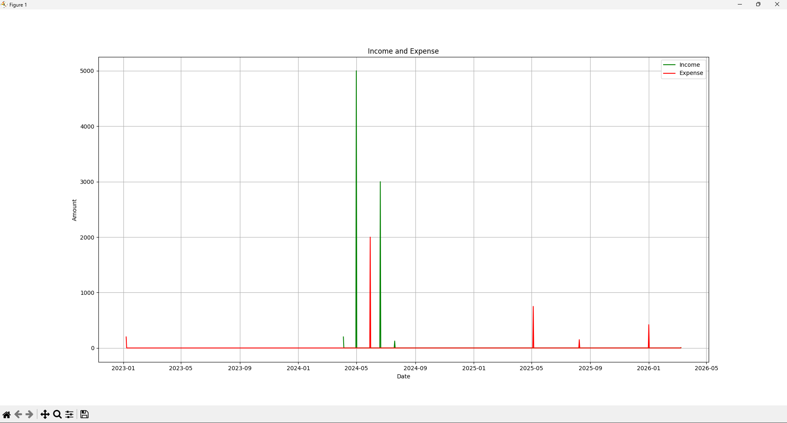

# Personal Finance Tracker
 


 
A command-line Python application for logging, categorising, and visualising personal finances over time. Transactions are stored locally in CSV format — no database or external services required. Users can filter by date range, view a financial summary, and generate a time-series chart of income vs expenses.

---

## 📸 Preview
 


---

## Setup

### Prerequisites
 
- Python 3.10+
- pip

---

## 💻 Usage
 
On launch, the app presents an interactive menu:
 
```
1. Add a new transaction
2. View transactions and summary within a date range
3. Exit
```
 
**Adding a transaction:**
```
Date (dd-mm-yyyy) or 'today': 15-03-2025
Amount: 1500
Category ('I' for Income or 'E' for Expense): I
Description: March salary
```
 
**Viewing a summary:**
```
Enter start date (dd-mm-yyyy): 01-03-2025
Enter end date (dd-mm-yyyy): 31-03-2025
 
Total Income:   £1500.00
Total Expense:  £320.00
Net Savings:    £1180.00
```

## 🗂️ Project Structure
 
```
Finance-Tracker/
├── main.py          # CSV class, plot_transactions, add(), and main menu loop
├── data_entry.py    # Input validation — get_date, get_amount, get_category, get_description
├── assets/
│   └── preview.png  # Graph screenshot
└── README.md
```

---

## 🛠️ Tech Stack
 
| Library | Purpose |
|---|---|
| Pandas | CSV handling, DataFrame filtering, date-range queries, daily resampling |
| Matplotlib | Time-series line chart — income vs expenses |
| datetime | Date parsing and validation |
| csv | Writing structured transaction entries |

---

## ✨ Features
 
- 📥 **Transaction Logging** — Record income or expense entries with a date, amount, category, and description
- 📅 **Date Range Filtering** — Query all transactions between two dates using Pandas boolean masking
- 📊 **Financial Summary** — Automatically calculates total income, total expenses, and net savings for any period
- 📈 **Visual Graph** — Plots daily income and expenses as a time-series line chart using Matplotlib, resampled by day
- 💾 **CSV Persistence** — All data is saved to a local `finance_data.csv` file, auto-created on first run
- ✅ **Input Validation** — Every user input is validated before being written to the file, preventing malformed data

---

## 🔮 Future Improvements
 
- Graphical interface using Tkinter
- PDF export of financial summaries
- Monthly budget goals and spending alerts
- Multi-currency support
- Migrate from CSV to SQLite for more robust data handling
